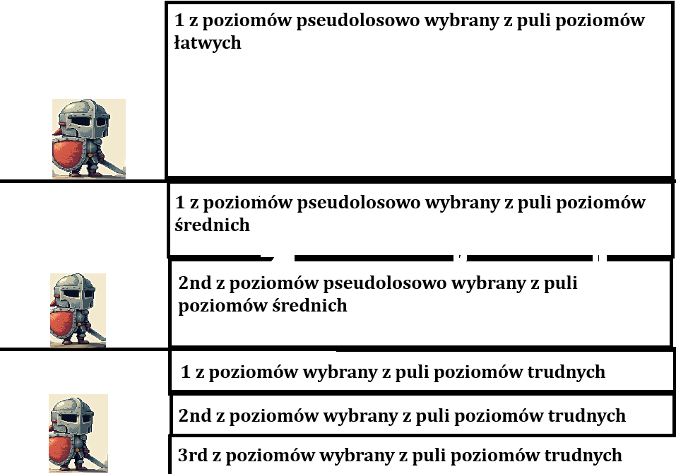

First Stage - Starość (w czasach fantasy to już może być  40-50 lat, ważne żeby postać miała brodę)

Postać widzi tylko jedną ścieżkę bo z doświadczenia już wie, jak wybierać tą dobrą, ma stalową zbroję więc kolizja z obiektami słabo na nią wpływa, porusza się powoli, zużywa szybciej stamine, ale za to ma łatwiejsze poziomy, co trzeba wybalansować

Second Stage - Wiek Średni

Postać widzi więcej 2 ścieżki , już prawie wie którą lepiej wybrać , posiada skórzaną zbroję więc kolizja z obiektami średnio na nią wpływa, porusza się z średnią prędkością, zużywa
normalne pokłady staminy za co ma średni poziomy, też trzeba wybalansować

Third Stage - Młodość

Postać widzi 3 ścieżki i nie wie która lepsza, nie posiada zbroi więc wszelkie kolizje bardzo na niego wpływają, porusza się szybko, zużywa mu to mało staminy przez co ma trudne poziomy, też również trzeba dobalansować

# Jakiś obrazek

A więc tak, na obrazku macie rycerzyka, on tam jest tylko po to żeby oddać to , co mniej więcej byłoby widoczne na ekranie. Koncepcję wymyśliłem, żeby jak mamy te 2 poziomy obok siebie to fajnie byłoby gdyby postać mogła czasem przechodzić z jednego na drugi, bądź trzeci, i to tylko widok jakby, jak widzę poziomy trudności, oczywiście wciąż póki jest 1 stage to te poziomy  będzie ich kilka losowo wybieranych.